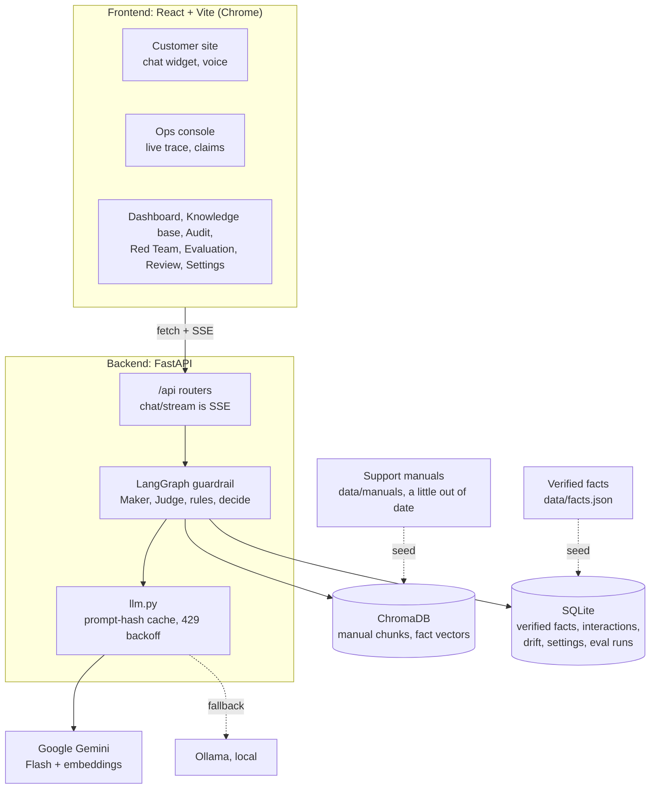
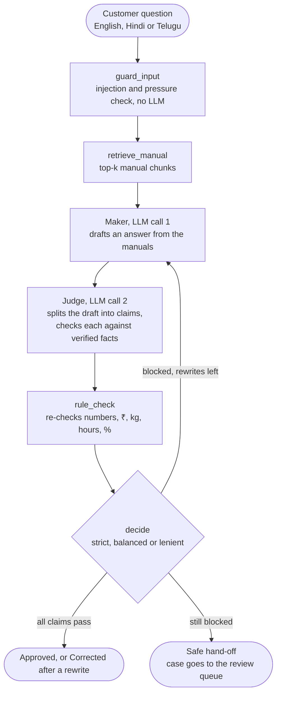

# VeriTrust AI

**A Maker and Judge guardrail that stops a support chatbot from telling customers things that
aren't true.** Built for the GDG on Campus GRIET hackathon.

The demo is a customer-support assistant for a fictional airline, **Charminar Airways**. One agent
(the Maker) drafts an answer from the company's support manuals. A second agent (the Judge) breaks
the draft into single claims and checks each one against a database of verified facts. A rule layer
re-checks every number. A wrong claim sends the draft back for a rewrite; if it still fails, the
customer gets a safe hand-off and the case goes to a person.

The manuals are deliberately a little out of date compared with the verified facts (four planted
stale prices). That is how wrong answers happen in real companies: the bot faithfully repeats a
document nobody updated. VeriTrust catches it.

## Results

80 questions, each answered with and without the guardrail
([full write-up and caveats](docs/EVAL_RESULTS.md)).

| | Without guardrail | With guardrail |
|---|---|---|
| Wrong answers reaching the customer | **28.8%** (23 of 80) | **1.2%** (1 of 80) |
| After hand-checking the grades | 23.8% (19 of 80) | **0%** (0 of 80) |
| Out-of-date manual prices answered wrong | 14 of 15 | **0 of 15** |
| Planted false details caught | – | **94.7%** (72 of 76) |
| Correct answers wrongly blocked | – | **0%** (0 of 35) |
| Blocked drafts fixed by a rewrite | – | 100% |
| Median answer time | 5.0 s | 8.1 s |

The one remaining "wrong" guarded answer is a grader false alarm on a correct refusal, which is
why the hand-checked rate is 0%. Times are from the free Gemini tier.

## Architecture



What happens to one question:



- A normal answer costs 2 LLM calls (Maker + Judge), plus 2 for each rewrite.
- Every step emits start and end events, streamed to the ops console as the answer is checked.
- The trust score is deterministic: start at 100, −40 per contradicted claim, −15 per unsupported
  claim, −10 per rewrite; an escalated answer scores 0.
- Phone numbers, emails and booking codes are redacted before anything reaches the model or the
  log.

## What's in the app

| Page | What it shows |
|---|---|
| Customer site (`/site`) | The airline's site with the chat widget, voice in and out |
| Live console (`/`) | The verification trace, every claim highlighted in the draft, the drafts and a diff of what the rewrite changed |
| Dashboard | Approved vs blocked over time, catch rate, latency per step, every interaction with a detail drawer, CSV/JSON export |
| Review queue | Escalated cases for a person to answer; a reply can be saved as a new verified fact |
| Knowledge base | The verified facts, editable live, with a drift timeline of every change |
| Manual audit | Scans the manuals against the facts and lists the out-of-date sections |
| Red Team Lab | 21 attacks (fake fees, pressure, prompt injection, invented policies) with a live scoreboard |
| Evaluation | The before and after numbers above |
| Settings | Strictness, number of rewrites, high-risk categories, alert rule |

Each interaction also has a printable audit report.

## Setup

You need Python 3.11, Node 22 and a free Gemini API key from https://aistudio.google.com.

**1. Configure.** In the repo root, copy `.env.example` to `.env` and fill in:

```
GEMINI_API_KEY=your key
GEMINI_MODEL=a Flash-class chat model
GEMINI_EMBED_MODEL=an embedding model
```

Model names are read from `.env`, never hardcoded. `GEMINI_MODEL_FALLBACKS` takes a comma-separated
list to try when the first model is overloaded or out of its daily free quota.

**2. Backend.**

```bash
cd backend
python -m venv .venv
.venv\Scripts\activate          # macOS/Linux: source .venv/bin/activate
pip install -r requirements.txt
python scripts/seed.py          # loads the facts into SQLite, builds the Chroma index
uvicorn app.main:app --port 8000
```

**3. Frontend**, in a second terminal.

```bash
cd frontend
npm install
npm run dev
```

Open http://localhost:5173 in Chrome (voice uses Chrome's Web Speech API). The customer site is at
http://localhost:5173/site.

**Optional: local fallback.** With [Ollama](https://ollama.com) running (`ollama pull gemma3:4b`
and `ollama pull nomic-embed-text`), the backend switches to it when Gemini is unreachable or keeps
rate limiting. It is much slower. `LLM_PROVIDER=ollama` makes it the main provider.

## Before a demo

With the backend stopped:

```bash
cd backend
python scripts/demo_warmup.py
```

Then start the backend. The script:

1. **Resets the demo state:** verified facts back to `data/facts.json` (undoing a live fee edit
   and any fact saved from the review queue) and settings back to the defaults. Interaction
   history, the drift timeline and eval runs are kept.
2. **Runs every demo request once** so it is stored in the LLM cache. On stage those answers
   replay in under a second, with no rate limits, even if Gemini is down.
3. **Refills the review queue** with two real escalated cases.
4. Prints one line per request and ends with `Ready: 22/22 requests replay from cache.` If Gemini
   runs out of quota part-way, run it again later; finished requests are kept.

The cache is keyed by the exact prompt, so a request only replays if it is asked exactly as
warmed. The demo script below says what to type.

## Demo script

| # | Do this | What the audience sees |
|---|---|---|
| 1 | Customer site: open the chat, tap "How much cabin baggage can I carry on a domestic flight?" | The answer appears |
| 2 | Live console (keep it open in another tab) | The same request, mirrored: trace animates, every claim green |
| 3 | Press `I`, then tap "How long does a refund take if I cancel my flight?" | A false detail is caught (red claim), the draft loops back, the corrected answer and the diff |
| 4 | Press `I` again (off). Tap "What does it cost to change the date of my Hyderabad to Delhi flight?" | The manual says ₹2,500, the verified fact says ₹3,000: caught and corrected |
| 5 | Knowledge base: change FEE-001 (domestic date change fee) to **3500**. Ask the step 4 question again | ₹3,000 is now blocked, the answer says ₹3,500, the drift timeline shows the change |
| 6 | Console language: తెలుగు. Speak the question, or tap the first Telugu example | A Telugu answer, checked against the English facts |
| 7 | Red Team Lab: run the demo set (10 attacks) | The live scoreboard |
| 8 | Review queue: open the guitar case, send the reply, save it as a fact | The case is resolved and the knowledge base gains a fact |
| 9 | Dashboard, then Evaluation | The numbers, before and after |

Notes for the presenter:

- In step 5 type exactly `3500`; that is the edit the warmup cached.
- In step 6 a voice transcript can differ from the warmed text by a word, which means a live model
  call (a few seconds). Tapping the Telugu example always replays from cache.
- Error injection (`I`) is remembered per browser. Check the toggle in the top bar before you
  start.
- Keyboard: `Ctrl K` opens the command palette (every step above is in it), `G` then a letter goes
  to a page (`G D` dashboard, `G K` knowledge base, `G T` red team, `G R` review, `G E`
  evaluation, `G C` console), `?` lists the shortcuts.

## Evaluation

```bash
cd backend
python scripts/run_eval.py --mode all
```

`data/eval/questions.jsonl` has 80 questions with gold fact IDs: 35 answerable, 15 stale traps, 20
adversarial and 10 out of scope, in English, Hindi and Telugu. Each is answered in three modes:
**baseline** (the Maker alone, a plain RAG bot), **guarded** (the full guardrail) and **injected**
(the guardrail with a false detail planted in every first draft). Calls are throttled by `LLM_RPM`
and cached, so a finished run replays without using quota. Results are saved to the database and
shown on the Evaluation page. Method, per-category tables and the hand-check of the grader are in
[docs/EVAL_RESULTS.md](docs/EVAL_RESULTS.md).

**Model comparison.** To see how a small local model does in the same guardrail:

```bash
python scripts/run_eval.py --provider ollama --sample 24
```

The local model (Ollama, `OLLAMA_MODEL`) is the Maker and the Judge; Gemini still grades the final
answers, so the rates can be compared. `--sample 24` is a fixed sample with the full set's mix of
question types. The Evaluation page then shows Gemini and the local model side by side on the
answers graded in both runs. It takes hours on a laptop and can be stopped at any time: run the
same command again and finished work replays from the cache. Answers Gemini had no quota to grade
are kept and graded by a later rerun.

## The customer site on a phone

`/site` is an installable app (PWA): it has a manifest and icons, a service worker that caches the
app shell so it opens instantly and offline, and a full-screen chat on phones. Answers are never
cached; the chat always asks the guardrail live.

To open it on an Android phone on the same Wi-Fi:

1. Laptop: start the backend as usual, then in `frontend/` run `npm run phone`. It builds the app
   and serves it on the network at port 4173. Allow Node.js through Windows Firewall on Private
   networks if asked.
2. Laptop: find its Wi-Fi address with `ipconfig` (IPv4 Address, for example `192.168.1.23`).
3. Phone, in Chrome: open `chrome://flags/#unsafely-treat-insecure-origin-as-secure`, enter
   `http://192.168.1.23:4173` (your address), set it to Enabled and tap Relaunch. Chrome only
   installs apps, runs service workers and allows the microphone on HTTPS or localhost; this flag
   marks the laptop's address as secure on that phone.
4. Phone: open `http://192.168.1.23:4173/site` and tap **Install app** (or Chrome menu → Install
   app).

Notes: the service worker runs only in the built app (`npm run phone`), not in `npm run dev`.
While `npm run phone` is running, the ops pages and the API are reachable by anyone on the same
network, so use a network you trust or turn on sign-in. If the Wi-Fi blocks devices from talking
to each other, put the laptop on the phone's hotspot. Questions asked on the phone appear on the
Dashboard; the console's live mirror only works between tabs of one browser.

## Sign-in (optional)

The ops pages can sit behind Google sign-in (Firebase Auth). The customer site at `/site` is always
public. Without any setup the ops pages stay open and the top bar says sign-in isn't set up.

1. In the [Firebase console](https://console.firebase.google.com), create a project.
2. Authentication → Sign-in method → enable **Google**.
3. Project settings → Your apps → add a **Web app**, and copy its config into `.env`:

```
VITE_FIREBASE_API_KEY=...
VITE_FIREBASE_AUTH_DOMAIN=...
VITE_FIREBASE_PROJECT_ID=...
VITE_FIREBASE_APP_ID=...
VITE_AUTH_ALLOWED_EMAILS=you@example.com,teammate@example.com   # optional
```

4. Restart `npm run dev`. `localhost` is an authorised domain by default.

Without `VITE_AUTH_ALLOWED_EMAILS`, any Google account can sign in. The signed-in account's avatar
is in the top bar, with sign-out.

**If the venue Wi-Fi fails:** set `DEMO_BYPASS_AUTH=true` in `.env` and restart `npm run dev`.
Sign-in is skipped entirely and nothing is loaded from Firebase. A laptop that is already signed in
stays signed in without a connection, so this is only needed for a fresh browser.

This gate is on the screens only. The backend API has no authentication (a project rule for the
prototype), so it must not be exposed beyond the demo machine.

## Domain packs

The guardrail is not airline-specific. A second pack, **Golconda Bank** (a fictional bank: account
fees, card limits, loan rates, KYC rules, transfers), runs through the same graph, rules and
scoring with no change to the logic:

- 49 verified facts and 4 manuals, with 3 planted stale values (`data/packs/bank/STALE.md`)
- 10 red-team attacks and 20 eval questions

Load it once, then switch in the top bar (or with Ctrl K, "Switch the knowledge base"). No restart
is needed, and Charminar Airways stays the default:

```bash
cd backend
python scripts/seed.py --domain bank
python scripts/run_eval.py --domain bank      # optional: the bank's eval numbers
```

Each pack has its own database and search index (`backend/var/packs/<id>/`), so its facts,
dashboard, review queue and drift timeline are kept apart from the airline's. A pack is data plus
a prompt that names the company and its fact categories; see `backend/app/domains.py`. The
customer site and the demo script are the airline's, and `demo_warmup.py` always switches back to
it.

## Tests

```bash
cd backend && pytest -q          # rules, scoring, PII redaction, decide policy and more
cd frontend && npm test          # vitest
```

## Repo layout

```
backend/app/         FastAPI app: llm.py (all model calls), graph/ (the guardrail), rules.py,
                     scoring.py, pii.py, domains.py (domain packs), routers/
backend/scripts/     seed.py, demo_warmup.py, run_eval.py, seed_review.py
data/                manuals/*.md, facts.json, STALE.md (the planted differences),
                     eval/questions.jsonl, redteam/attacks.json, packs/bank/ (Golconda Bank)
frontend/src/        React app: pages/, features/, app/ (shell, command palette, shortcuts)
docs/                DESIGN.md, FEATURES.md, EVAL_RESULTS.md
```

## Tech stack

Python 3.11, FastAPI, LangGraph, Pydantic, Google Gemini (`google-genai`), ChromaDB, SQLite.
React, Vite, TypeScript, Tailwind, shadcn/ui, Recharts, motion, cmdk. Everything runs on free
tiers.

## Limitations

- The airline, its manuals and its facts are made up for the demo.
- 80 evaluation questions, written by the team that built the system; the grader is an LLM from
  the same family as the Judge, so its grades were hand-checked (it agreed on 34 of 40).
- The guardrail can only verify what the facts database covers. A claim with no matching fact is
  "unsupported", and whether that blocks the answer depends on the strictness setting.
- The guardrail adds about 3 seconds to a median answer. The free Gemini tier has low daily quotas
  and frequent overloads, which is what the cache and the warmup script are for.
- Sign-in protects the ops screens only; the API itself has no authentication. This is a
  prototype, not a deployment.
